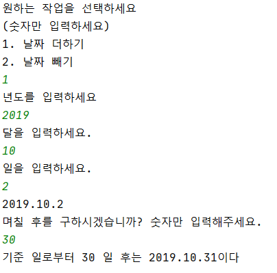
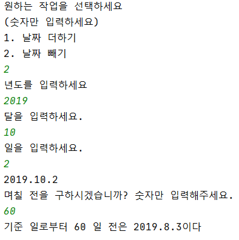

# DataCalculation

<ul>
  <li> 학교 과제로 만든 날짜 계산기 입니다. &nbsp (This is data calculation that made a university task)</li>
   
  <li> 지원언어는 자바이며 tool은 인텔리제이 입니다. &nbsp (Language is java, tool is intellij)</li>
   
  <li> 한국어만 지원됩니다. &nbsp (This program only offer Korean)</li>
   
  <li> 실행화면 - 날짜 더하기  
       
  </li>
   
   
  <li> 실행화면 - 날짜 빼기  
      
  </li>
</ul>

